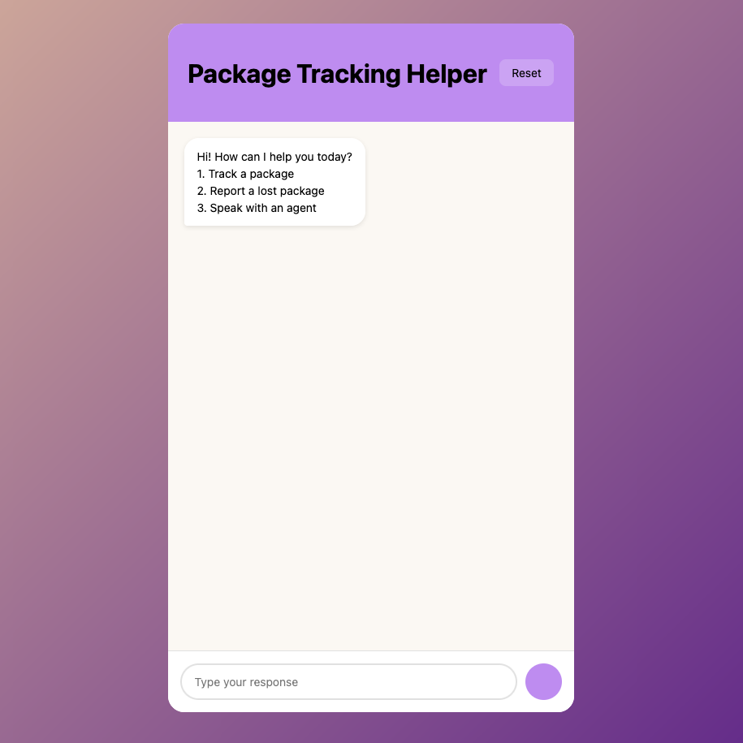
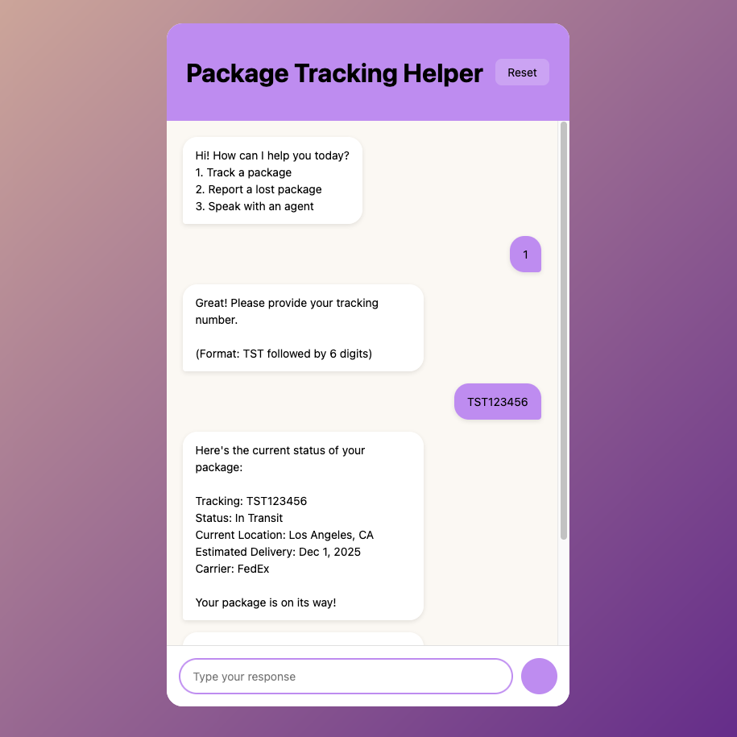
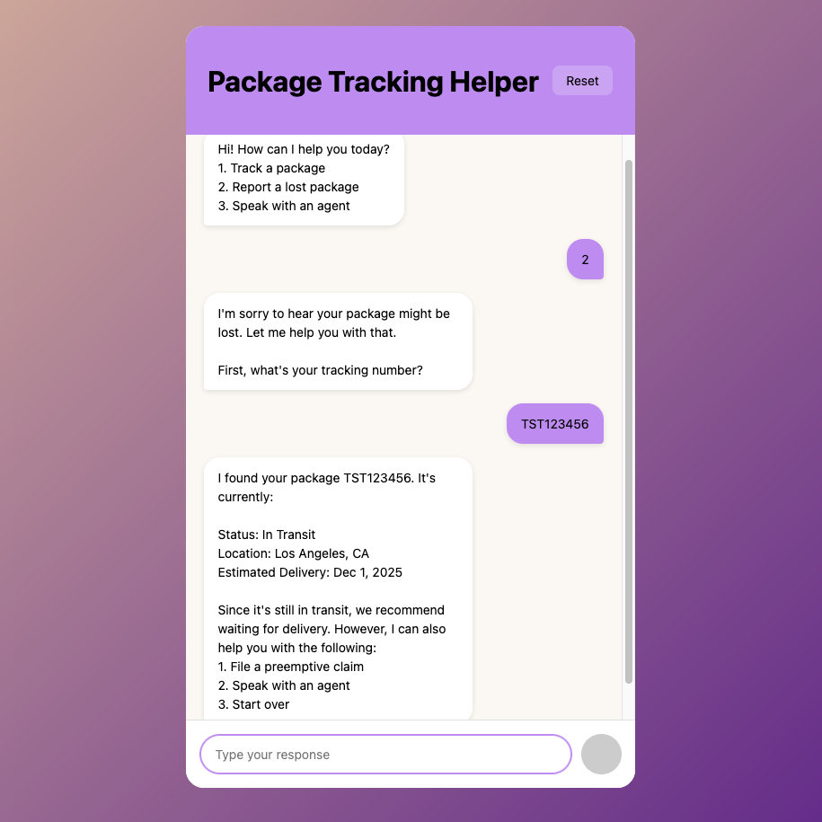
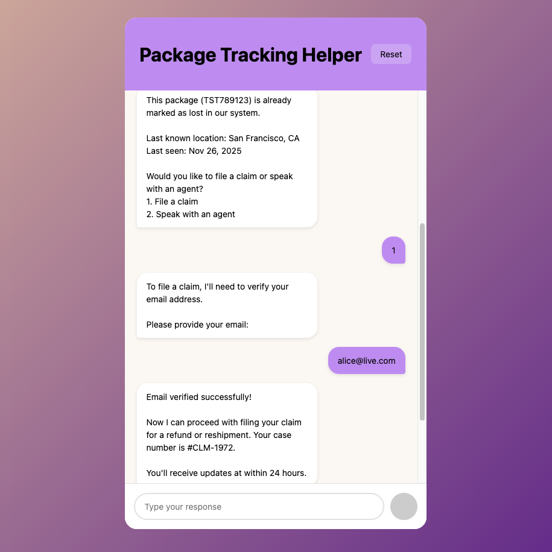

# chatbot_assignment
This code creates a chat bot that will help users with their orders. They can ask to see the delivery status using the tracking number or they can report a lost package. Most of this application was built on React and CSS, and used Vite to create the template.

Important files:
- `chatbot_conversation_tree.pdf`: the conversation tree that the application is based on. All of the conversation flows are shown in this diagram.
- `presentation.pdf`: the presentation for how this application was built, its features, its challenges, and its future improvements.
- `package-tracker/src/App.jsx`: the main file for the application logic
- `package-tracker/src/App.css`: the file for styling the application

The other files are boilerplate code generated by `npm create vite@latest package-tracker -- --template react`.

# Pre-requisites
- `Node.js`
- `Git`

# Setup
- Clone this repository locally.
- `cd` into `chatbot_assignment/package-tracker`. 
- Run the dev server using `npm run dev`.
- Access the chatbot at `http://localhost:5173/`.

# Screenshots

